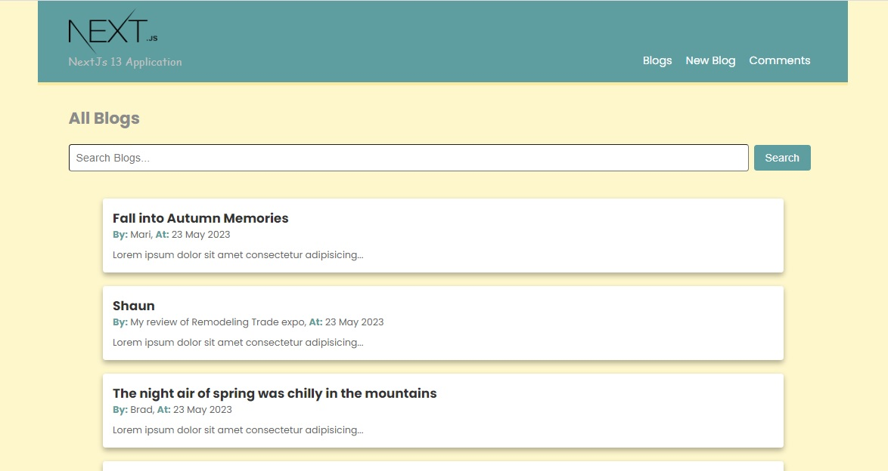
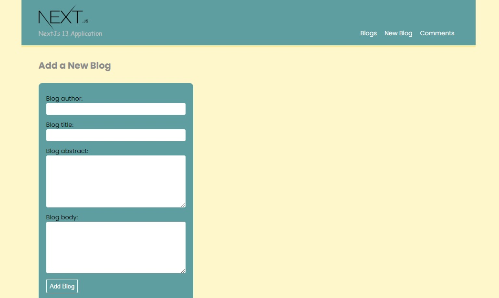

# Nextjs 13 - Blog Application (+ Mongoose)

#### By _**Mahashi-github**_

#### This is a Nextjs 13 & Mongoose Application. 

## Technologies Used
* _Nextjs 13_
* _React_
* _React-dom_
* _JSX_
* _CSS_
* _Javascript_
* _Node.js_
* _Mongoose_

## Setup
This application is made by 'npx create-next-app@latest'. 

An '.env.local' file with a URI variable 'MONGODB_URI' in the root directory is required.

To run this project, install it using npm:
```
$ npm install
```
To run the code:
```
$ npm run dev
```
## Note


## Screenshot of the Application
<p>
  
  
</p>